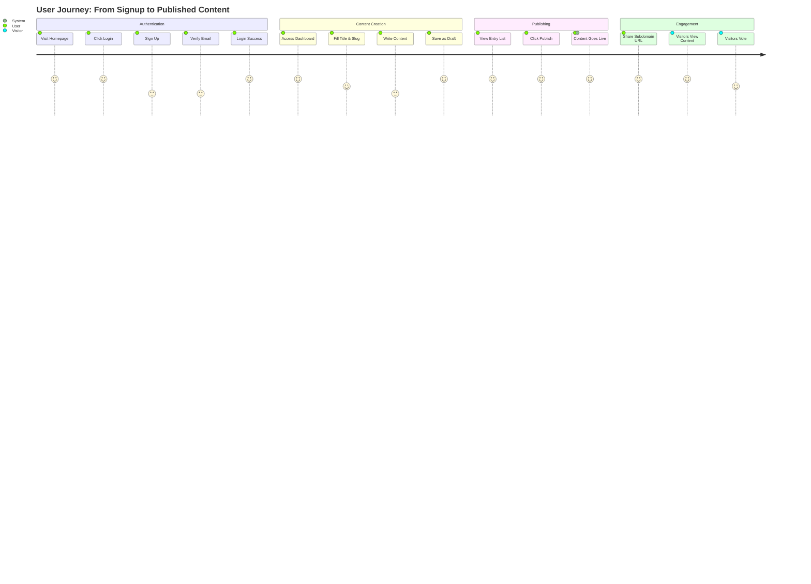
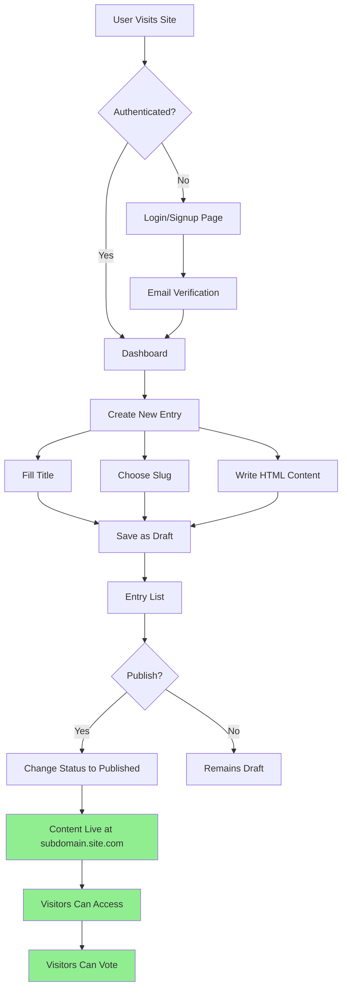
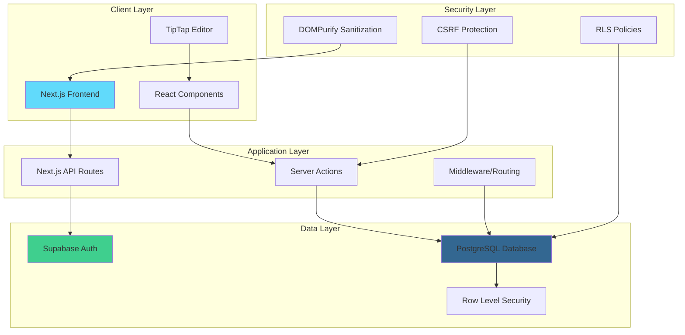
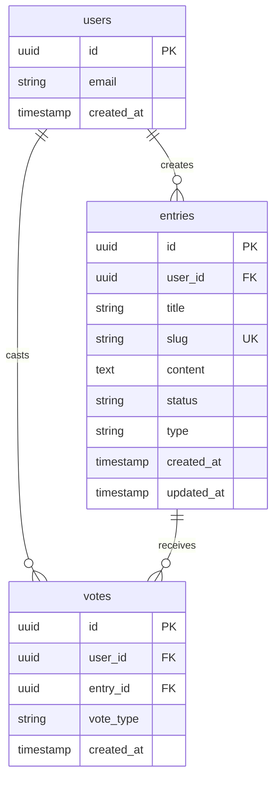
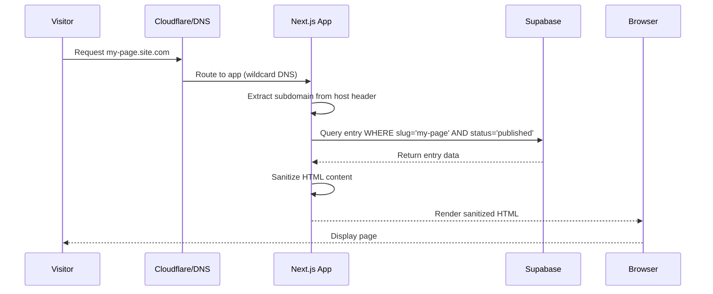
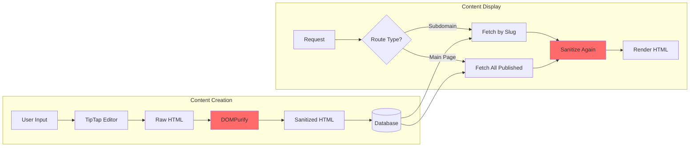
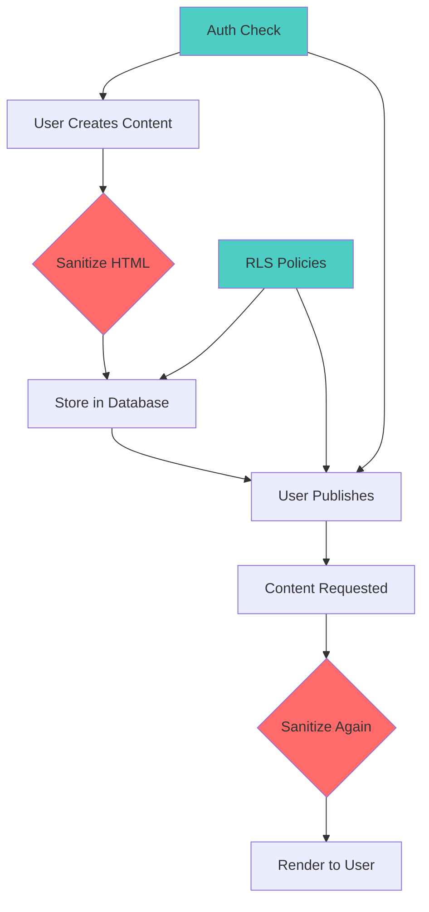
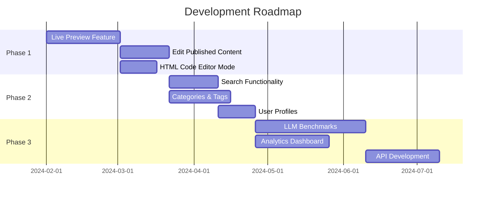

# LLM-Poison CMS: Comprehensive Project Report & Implementation Guide

## Table of Contents
1. [Executive Summary](#executive-summary)
2. [Project Overview](#project-overview)
3. [Getting Started](#getting-started)
4. [User Journey & Workflows](#user-journey--workflows)
5. [System Architecture](#system-architecture)
6. [Technical Implementation](#technical-implementation)
7. [Security Considerations](#security-considerations)
8. [Current Limitations & Future Roadmap](#current-limitations--future-roadmap)

---

## Executive Summary

LLM-Poison is a modern Content Management System (CMS) that enables users to create, publish, and manage HTML content through dynamically generated subdomains. Built with Next.js 15, Supabase, and TypeScript, it provides a secure platform for content creation with built-in voting functionality and future plans for LLM benchmarking capabilities.

### Key Features
- 🔐 Secure authentication via Supabase Auth
- ✏️ Rich text editing with TipTap editor
- 🌐 Dynamic subdomain routing (e.g., `my-page.yoursite.com`)
- 🛡️ HTML sanitization with DOMPurify
- 👍 Voting system for published content
- 📊 Row Level Security (RLS) for data protection

---

## Project Overview

### Technology Stack
```
Frontend:  Next.js 15.3.4, React 19, TypeScript, Tailwind CSS v4
Backend:   Supabase (PostgreSQL with RLS)
Editor:    TipTap with StarterKit
Security:  DOMPurify, Supabase RLS
Hosting:   Designed for Vercel deployment
```

### Project Structure
```
llm-poison/
├── app/                    # Next.js 15 app router
│   ├── page.tsx           # Main page & subdomain handler
│   ├── dashboard/         # User dashboard
│   ├── login/            # Authentication pages
│   └── api/              # API routes
├── components/            # React components
│   ├── Uploader.tsx      # Content creation form
│   ├── EntryList.tsx     # User's content list
│   ├── VoteButton.tsx    # Voting functionality
│   └── AuthStatus.tsx    # Auth state display
├── lib/                   # Utilities
│   └── supabase/         # Supabase clients
├── supabase/             # Database migrations
└── docs/                 # Documentation
```

---

## Getting Started

### Prerequisites
- Node.js 18+ and npm/yarn/pnpm
- Supabase account
- Domain with wildcard DNS support (for production)

### Quick Setup

1. **Clone the repository**
   ```bash
   git clone <repository-url>
   cd llm-poison
   npm install
   ```

2. **Configure environment variables**
   ```bash
   cp .env.example .env.local
   ```
   
   Update `.env.local`:
   ```env
   NEXT_PUBLIC_SUPABASE_URL=your-supabase-url
   NEXT_PUBLIC_SUPABASE_ANON_KEY=your-anon-key
   SUPABASE_SERVICE_ROLE_KEY=your-service-role-key
   NEXT_PUBLIC_ROOT_DOMAIN=localhost:3000  # or your-domain.com
   ```

3. **Set up Supabase**
   - Create a new Supabase project
   - Run the migration script from `supabase/migrations/001_initial_schema.sql`
   - Enable Email Auth in Authentication settings

4. **Run the development server**
   ```bash
   npm run dev
   ```

5. **Access the application**
   - Main site: `http://localhost:3000`
   - Dashboard: `http://localhost:3000/dashboard`

### Production Deployment (Vercel)

1. **Configure DNS**
   - Add wildcard A record: `*.your-domain.com → Vercel IP`
   - Add root A record: `your-domain.com → Vercel IP`

2. **Deploy to Vercel**
   ```bash
   vercel --prod
   ```

3. **Set environment variables in Vercel**
   - Add all variables from `.env.local`
   - Set `NEXT_PUBLIC_ROOT_DOMAIN=your-domain.com`

4. **Configure wildcard domain in Vercel**
   - Add `*.your-domain.com` to project domains

---

## User Journey & Workflows

### Complete User Flow Diagram



### Detailed Workflow



---

## System Architecture

### High-Level Architecture



### Database Schema



### Request Flow for Subdomain Access



---

## Technical Implementation

### Core Components

#### 1. **Dynamic Subdomain Routing** (`app/page.tsx`)
```typescript
// Extracts subdomain from host header
const host = headersList.get('host')
const rootDomain = process.env.NEXT_PUBLIC_ROOT_DOMAIN || 'localhost:3000'
const slug = host && host.endsWith(`.${rootDomain}`) 
  ? host.replace(`.${rootDomain}`, '') 
  : null

// If slug exists, fetch and render the specific page
if (slug) {
  const { data: entry } = await supabase
    .from('entries')
    .select('title, content')
    .eq('slug', slug)
    .eq('status', 'published')
    .single()
}
```

#### 2. **Content Creation Flow** (`components/Uploader.tsx`)
```typescript
// TipTap editor initialization
const editor = useEditor({
  extensions: [StarterKit],
  content: '<p>Hello World! 🌎️</p>',
})

// Sanitization before saving
const html = editor.getHTML()
const sanitizedHtml = DOMPurify.sanitize(html)

// Save to database
await supabase.from('entries').insert([{
  title,
  slug,
  content: sanitizedHtml,
  user_id: user.id,
  status: 'draft',
  type: 'page',
}])
```

#### 3. **Publishing Mechanism** (`components/ToggleStatusButton.tsx`)
- Simple status toggle: 'draft' ↔️ 'published'
- No DNS record creation needed
- Instant availability via wildcard routing

#### 4. **Security Implementation**
- **Double sanitization**: On save and on render
- **RLS policies**: Users can only modify their own content
- **Iframe sandboxing**: For preview cards on main page
- **CSRF protection**: Via Supabase's built-in mechanisms

### Data Flow Diagram



---

## Security Considerations

### Current Security Measures

1. **Input Sanitization**
   - DOMPurify removes dangerous HTML/JS
   - Applied on both save and render
   - Prevents XSS attacks

2. **Row Level Security (RLS)**
   ```sql
   -- Users can only update their own entries
   CREATE POLICY "Users can update own entries" ON entries
   FOR UPDATE USING (auth.uid() = user_id);
   
   -- Anyone can view published entries
   CREATE POLICY "Anyone can view published entries" ON entries
   FOR SELECT USING (status = 'published' OR auth.uid() = user_id);
   ```

3. **Authentication**
   - Supabase Auth with email verification
   - Session-based authentication
   - Secure cookie handling

4. **CSRF Protection**
   - Built into Supabase
   - Server actions validate user sessions

### Security Flow



---

## Current Limitations & Future Roadmap

### Current Limitations

1. **No Live Preview**
   - Users cannot preview HTML before publishing
   - Must publish to see rendered output

2. **No Content Editing**
   - Published content cannot be edited
   - Must unpublish → edit → republish

3. **Limited Content Management**
   - No search functionality
   - No categories or tags
   - No content versioning

4. **Basic Editor**
   - TipTap provides WYSIWYG but no HTML mode
   - No syntax highlighting for HTML

### Recommended Improvements



### Priority Enhancements

1. **Live Preview Implementation**
   ```typescript
   // Add preview pane to Uploader component
   const [showPreview, setShowPreview] = useState(false)
   const sanitizedPreview = DOMPurify.sanitize(editor?.getHTML() || '')
   
   // Render preview in iframe
   <iframe 
     srcDoc={sanitizedPreview}
     sandbox="allow-scripts"
   />
   ```

2. **Edit Functionality**
   - Add edit button to EntryList
   - Load existing content into editor
   - Update instead of insert

3. **Search Implementation**
   - Full-text search on title and content
   - Filter by status, date, user

---

## Conclusion

LLM-Poison CMS is a well-architected, security-focused content management system with 85% of core features implemented. The dynamic subdomain routing works seamlessly, and the security measures are robust. The main areas for improvement are user experience features like live preview and content editing capabilities.

The codebase is clean, well-documented, and follows modern React/Next.js best practices, making it ready for production deployment with minor enhancements.